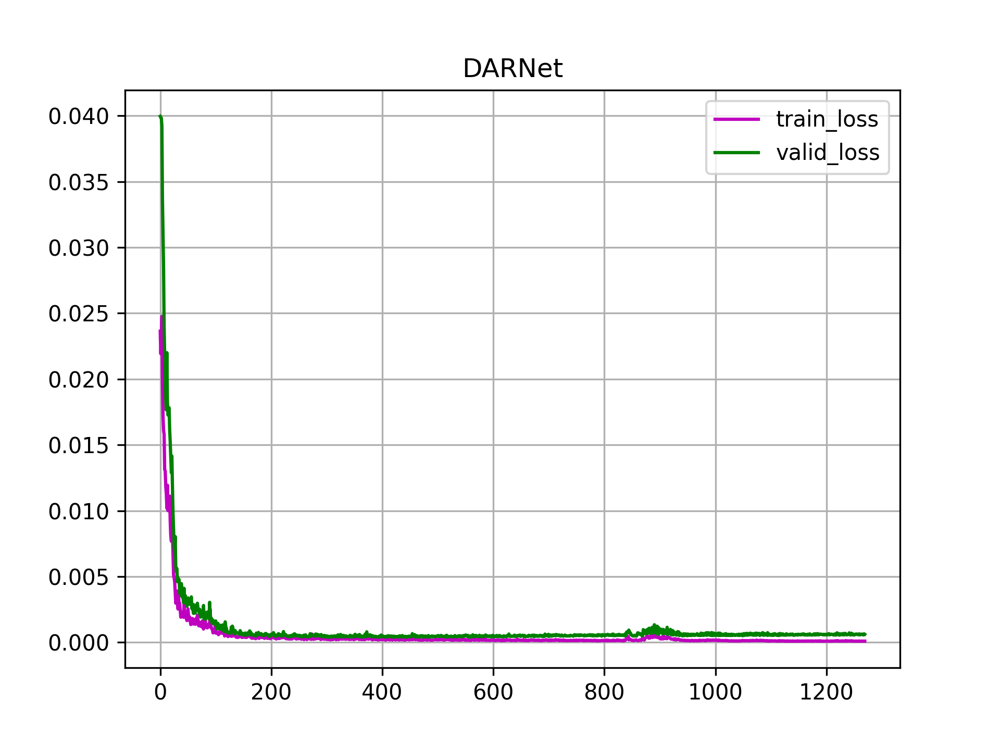

# DARNet
Original Implementation of "DARNet: Dual-head Attention Residual
Network for Multi-Step Short-Term Load Forecasting"

## Clone project
You need to clone the project first.
```
git clone https://github.com/Mark-THU/DARNet-load-forecasing.git
cd DARNet-load-forecasing
```
## Dependencies
python 3.8.12

You may check and install other dependent packages in `requirments.txt`.
```
$ pip install -r requirements.txt
```
To install Pytorch, you may follow the official instructions [here](https://pytorch.org/).  
## Usage
The following examples will show you how to train and test a model
on a specific dataset with settings used in this work.

### DARNet
```
$ python main.py --dataset D1 --model DARNet --seq_len 72 --target_len 24 --batch_size 256 \
                 --lr 0.01 --num_epoch 80 --hidden_dim 64 --n_layers 3 --drop_prob 0.5 \
                 --weight_decay 0 --mse_thresh 0.01 --gpu cuda:0 --seed 0
```
Training losses and evaluation losses will be represented in a figure named `DARNet.png`, which will be saved in `./figs` folder.
The trained model's state dict will be saved in the `./models/model` folder. Each metrics utilized in the paper will be printed on
the screen. Ground-truth values as well as predicted values will be saved in the `./results` folder. 



### BiLSTM
```
$ python main.py --dataset D1 --model BiLSTM --seq_len 72 --target_len 24 --batch_size 256 \
                 --lr 0.01 --num_epoch 80 --hidden_dim 64 --n_layers 3 --drop_prob 0 \
                 --weight_decay 0 --mse_thresh 0.01 --gpu cuda:0 --seed 0
```

### GRU_CNN
```
$ python main.py --dataset D1 --model GRU_CNN --seq_len 72 --target_len 24 --batch_size 256 \
                 --lr 0.01 --num_epoch 80 --hidden_dim 128 --n_layers 1 --drop_prob 0 \
                 --weight_decay 0.00001 --mse_thresh 0.01 --gpu cuda:0 --seed 16
```

### Seq2Seq
```
$ python main.py --dataset D1 --model Seq2Seq --seq_len 72 --target_len 24 --batch_size 512 \
                 --lr 0.01 --num_epoch 80 --hidden_dim 64 --n_layers 2 --drop_prob 0.5 \
                 --weight_decay 0 --mse_thresh 0.01 --gpu cuda:0 --seed 42
```
